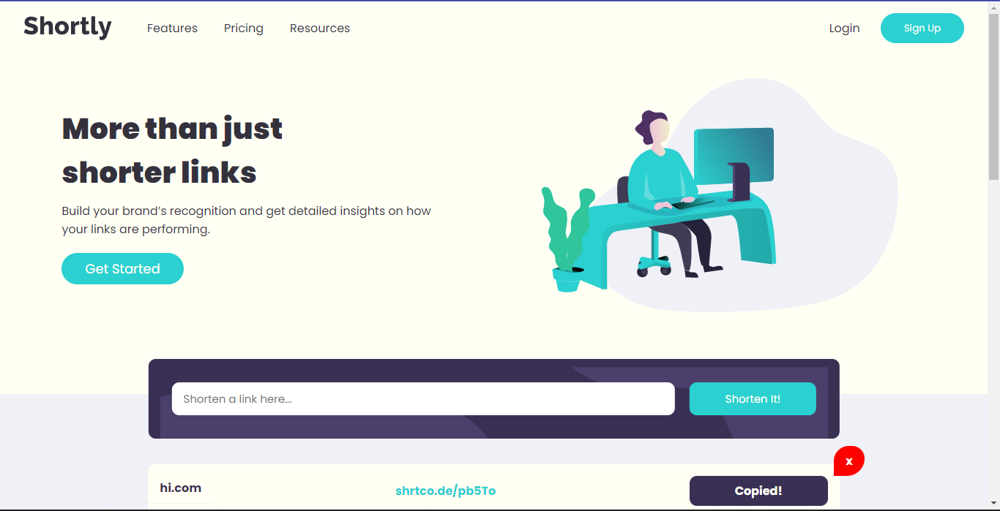

# Frontend Mentor - Shortly URL shortening API Challenge solution

This is a solution to the [Shortly URL shortening API Challenge challenge on Frontend Mentor](https://www.frontendmentor.io/challenges/url-shortening-api-landing-page-2ce3ob-G). Frontend Mentor challenges help you improve your coding skills by building realistic projects. 

## Table of contents

- [Overview](#overview)
  - [The challenge](#the-challenge)
  - [Screenshot](#screenshot)
  - [Links](#links)
- [My process](#my-process)
  - [Built with](#built-with)
  - [What I learned](#what-i-learned)
  - [Continued development](#continued-development)
  - [Useful resources](#useful-resources)
- [Author](#author)
- [Acknowledgments](#acknowledgments)

## Overview

### The challenge

Users should be able to:

- View the optimal layout for the site depending on their device's screen size
- Shorten any valid URL
- See a list of their shortened links, even after refreshing the browser
- Copy the shortened link to their clipboard in a single click
- Receive an error message when the `form` is submitted if:
  - The `input` field is empty

### Screenshot



### Links

- Solution URL: [GITHUB](https://github.com/TonniPaul/url-shortener)
- Live Site URL: [LIVE SITE](https://shorturl.tonnipaul.com)

## My process

- First Created the components without functionality.
- Added Functionality

### Built with

- Semantic HTML5 markup
- CSS custom properties
- Flexbox
- CSS Grid
- Mobile-first workflow
- [React](https://reactjs.org/) - JS library
- [Next.js](https://nextjs.org/) - React framework
- [TypeScript](https://www.typescriptlang.org/) - TypeScript


### What I learned

```js
  const copy = async () => {
    await navigator.clipboard.writeText(text);
    alert('Text copied');
  }
}
```

### Continued development

### Useful resources

- [Click To Copy Function](https://www.kindacode.com/article/react-copy-to-clipboard-when-click-a-button-link/) - I learnt how to implement the click-to-copy function.


## Author

- Website - [Paul Oluwatoni Ariyo-Adeoye](https://tonnipaul.com)
- Frontend Mentor - [@tonnipaul](https://www.frontendmentor.io/profile/tonnipaul)
- Twitter - [@tonnipaul](https://www.twitter.com/tonnipaul)


